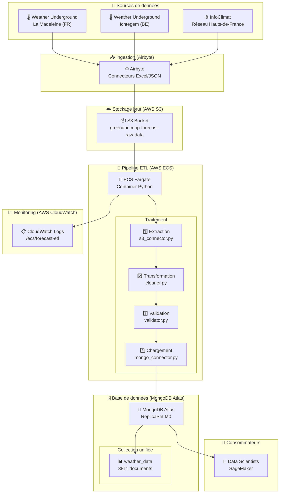
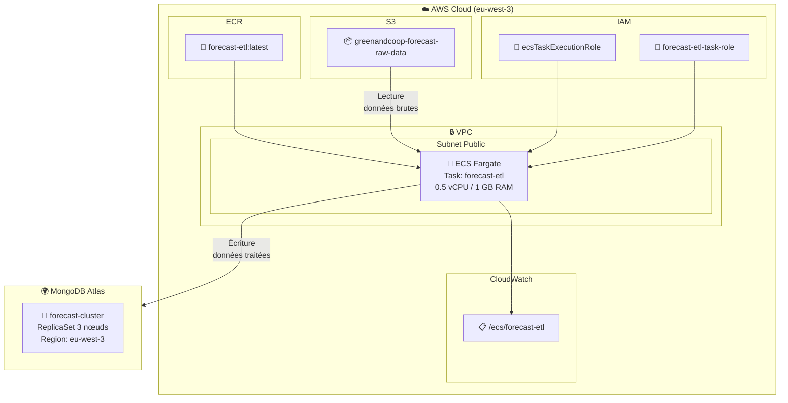
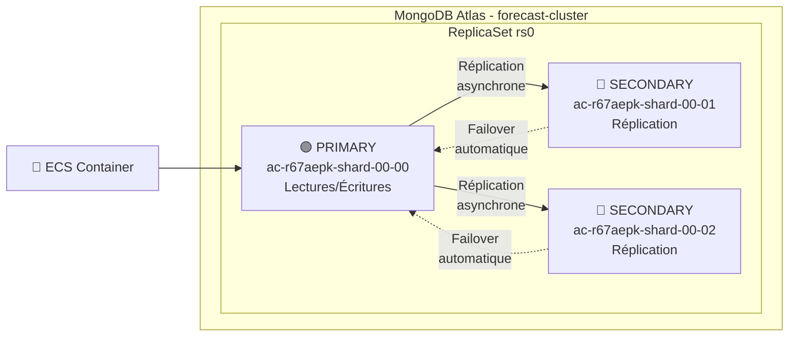
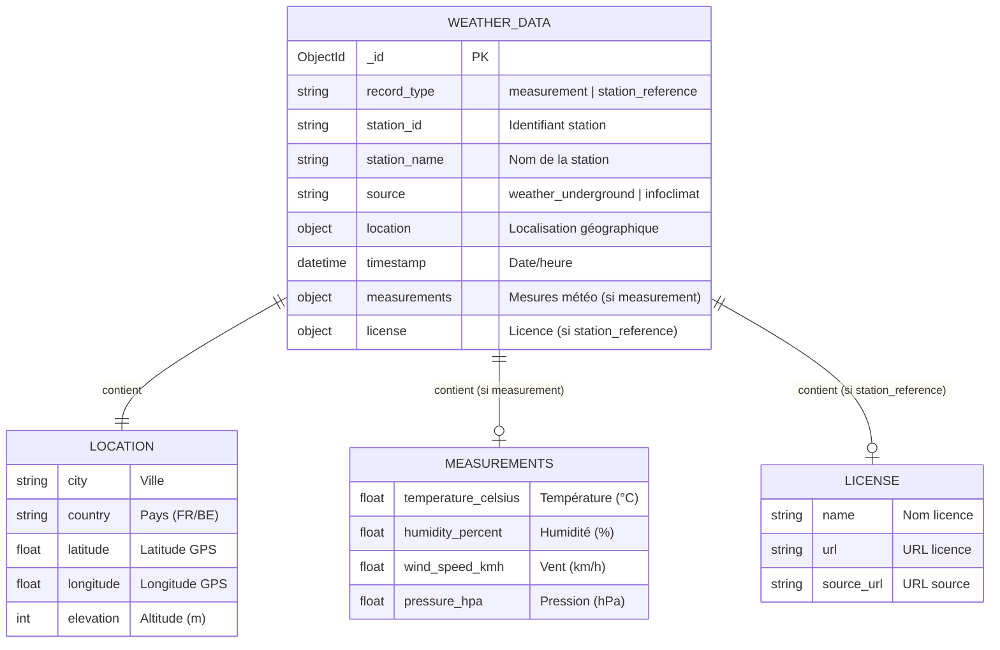
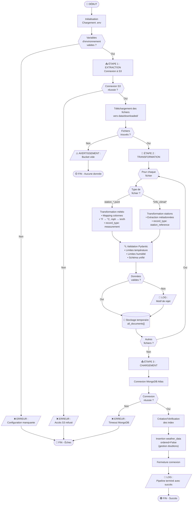

# 🌤️ Forecast 2.0 - Pipeline de Données Météorologiques

[](https://www.python.org/)
[](https://www.mongodb.com/atlas)
[](https://aws.amazon.com/ecs/)
[](https://www.docker.com/)

## 📋 Table des matières

1. [Contexte du projet](#-contexte-du-projet)
2. [Architecture technique](#-architecture-technique)
3. [Justifications techniques](#-justifications-techniques)
4. [Schéma de la base de données](#-schéma-de-la-base-de-données)
5. [Logigramme du processus ETL](#-logigramme-du-processus-etl)
6. [Stack technique](#-stack-technique)
7. [Guide de déploiement](#-guide-de-déploiement)
8. [Reporting et métriques](#-reporting-et-métriques)
9. [Structure du projet](#-structure-du-projet)

---

## 🎯 Contexte du projet

### L'entreprise

**GreenAndCoop** est un fournisseur coopératif français d'électricité d'origine renouvelable dans les Hauts-de-France.

### Le besoin métier

Pour optimiser ses prévisions de demande d'électricité, GreenAndCoop a lancé le projet **Forecast 2.0** avec les objectifs suivants :

| Objectif | Description |
|----------|-------------|
| **Équilibrer le réseau** | Assurer l'équilibre production/consommation en temps réel pour éviter les pénalités |
| **Optimiser la production** | Planifier l'utilisation des sources renouvelables (solaire, éolien) |
| **Gérer les coûts** | Réduire les achats d'urgence sur le marché de gros |

### Mission Data Engineer

Intégrer de nouvelles sources de données météorologiques (stations semi-professionnelles) dans un pipeline fiable pour alimenter les modèles de prévision des Data Scientists.

### Sources de données

| Source | Type | Localisation | Format |
|--------|------|--------------|--------|
| Weather Underground | Station amateur | La Madeleine (FR) | Excel → JSONL |
| Weather Underground | Station amateur | Ichtegem (BE) | Excel → JSONL |
| InfoClimat | Réseau open-data | Hauts-de-France | JSON → JSONL |

---

## 🏗️ Architecture technique

### Architecture globale



### Architecture de déploiement AWS



### Architecture MongoDB Atlas (ReplicaSet)



---

## 💡 Justifications techniques

### Pourquoi MongoDB Atlas plutôt que MongoDB sur ECS ?

| Critère | MongoDB sur ECS (Self-hosted) | MongoDB Atlas (Managé) |
|---------|-------------------------------|------------------------|
| **ReplicaSet** | ❌ Très complexe à configurer (IPs dynamiques, Service Discovery) | ✅ Inclus et géré automatiquement |
| **Haute disponibilité** | ❌ Configuration manuelle du failover | ✅ Failover automatique en ~30s |
| **Sécurité** | ⚠️ Gestion manuelle (KeyFile, TLS) | ✅ Chiffrement at-rest et in-transit inclus |
| **Sauvegardes** | ❌ À implémenter (scripts, S3) | ✅ Snapshots automatiques inclus |
| **Monitoring** | ❌ À configurer (Prometheus, Grafana) | ✅ Dashboard intégré avec alertes |
| **Coût (petit volume)** | ~$30-50/mois (3 instances EC2) | ✅ **Gratuit** (M0 Free Tier) |
| **Maintenance** | ❌ Patches, upgrades manuels | ✅ Automatique |
| **Temps de mise en place** | ~2-3 jours | ~10 minutes |

**Conclusion** : Pour un projet d'étude avec un faible volume de données (~1.7 Mo), MongoDB Atlas M0 offre toutes les fonctionnalités d'un ReplicaSet de production **gratuitement**, sans la complexité opérationnelle.

### Pourquoi ECS Fargate ?

| Critère | EC2 | ECS Fargate |
|---------|-----|-------------|
| **Gestion serveurs** | ❌ Provisioning, patches | ✅ Serverless |
| **Scaling** | ⚠️ Manuel ou Auto Scaling Groups | ✅ Automatique |
| **Coût (job ponctuel)** | ~$0.50/heure (instance allumée) | ✅ ~$0.01/exécution (pay-per-use) |
| **Complexité** | ⚠️ AMI, Security Groups, etc. | ✅ Juste une Task Definition |

**Conclusion** : Pour un job ETL ponctuel qui s'exécute en ~1 seconde, Fargate est idéal (on ne paie que le temps d'exécution).

### Pourquoi une collection unifiée `weather_data` ?

| Critère | 2 collections (measurements + stations) | 1 collection unifiée (weather_data) |
|---------|----------------------------------------|-------------------------------------|
| **Requêtes Data Scientists** | ⚠️ Jointures nécessaires ($lookup) | ✅ Requête directe, pas de jointure |
| **Performance** | ⚠️ $lookup coûteux sur gros volumes | ✅ Lecture directe optimale |
| **Schéma** | ⚠️ Données éclatées | ✅ Documents auto-portants |
| **Flexibilité** | ⚠️ 2 schémas à maintenir | ✅ 1 schéma avec `record_type` discriminant |

**Conclusion** : MongoDB n'est pas optimisé pour les jointures. Une collection unifiée avec un champ `record_type` permet des requêtes simples et performantes.

### Pourquoi Airbyte pour l'ingestion ?

| Critère | Scripts manuels | Airbyte |
|---------|-----------------|---------|
| **Connecteurs** | ❌ À développer | ✅ 300+ connecteurs prêts |
| **Transformation** | ❌ Code custom | ✅ Normalisation automatique |
| **Monitoring** | ❌ À implémenter | ✅ UI avec historique |
| **Orchestration** | ❌ Cron + scripts | ✅ Scheduling intégré |

---

## 🗄️ Schéma de la base de données

### Vue d'ensemble

Le projet utilise une **collection unique `weather_data`** avec un champ discriminant `record_type` pour différencier les types de documents :

| record_type | Description | Nombre |
|-------------|-------------|--------|
| `measurement` | Relevés météorologiques | 3807 |
| `station_reference` | Métadonnées des stations InfoClimat | 4 |

### Diagramme du schéma unifié



### Document type `measurement` (relevés météo)

```json
{
    "_id": "ObjectId('...')",
    "record_type": "measurement",
    "station_id": "IICHTE19",
    "station_name": "WeerstationBS",
    "source": "weather_underground",
    "location": {
        "city": "Ichtegem",
        "country": "BE",
        "latitude": 51.092,
        "longitude": 2.999,
        "elevation": 15
    },
    "timestamp": "2025-12-24T00:04:00.000Z",
    "measurements": {
        "temperature_celsius": 13.78,
        "humidity_percent": 87,
        "wind_speed_kmh": 13.2,
        "pressure_hpa": 998.3
    }
}
```

### Document type `station_reference` (métadonnées)

```json
{
    "_id": "ObjectId('...')",
    "record_type": "station_reference",
    "station_id": "00052",
    "station_name": "Armentières",
    "source": "infoclimat",
    "location": {
        "city": "Armentières",
        "country": "FR",
        "latitude": 50.689,
        "longitude": 2.877,
        "elevation": 16
    },
    "station_type": "static",
    "license": {
        "name": "CC BY",
        "url": "https://creativecommons.org/licenses/by/2.0/fr/",
        "source_url": "https://www.infoclimat.fr/stations/metadonnees.php?id=00052"
    },
    "timestamp": "2025-12-24T15:18:22.000Z"
}
```

### Validation des données (Pydantic)

| Champ | Règle | Motif de rejet |
|-------|-------|----------------|
| `station_id` | Requis, non vide | `station_id: Field required` |
| `timestamp` | Requis, type datetime | `timestamp: Invalid datetime` |
| `temperature_celsius` | -60 ≤ T ≤ +60 | `temperature_celsius: greater than 60` |
| `humidity_percent` | 0 ≤ H ≤ 100 | `humidity_percent: greater than 100` |
| `wind_speed_kmh` | ≥ 0 | `wind_speed_kmh: less than 0` |
| `pressure_hpa` | 800 ≤ P ≤ 1200 | `pressure_hpa: less than 800` |
| `latitude` | -90 ≤ lat ≤ 90 | `latitude: out of range` |
| `longitude` | -180 ≤ lng ≤ 180 | `longitude: out of range` |

### Index créés

```javascript
// Index 1 : Recherche par station et date (requêtes temporelles)
db.weather_data.createIndex(
    { "station_id": 1, "timestamp": 1 },
    { name: "idx_station_timestamp" }
)

// Index 2 : Filtrage par type de document
db.weather_data.createIndex(
    { "record_type": 1 },
    { name: "idx_record_type" }
)

// Index 3 : Recherche par source de données
db.weather_data.createIndex(
    { "source": 1 },
    { name: "idx_source" }
)

// Index 4 : Unicité pour les stations de référence
db.weather_data.createIndex(
    { "record_type": 1, "station_id": 1, "source": 1 },
    { unique: true, partialFilterExpression: { "record_type": "station_reference" } }
)
```

### Requêtes utiles pour les Data Scientists

```javascript
// Toutes les mesures météo
db.weather_data.find({ record_type: "measurement" })

// Mesures d'une station spécifique
db.weather_data.find({
    record_type: "measurement",
    station_id: "IICHTE19"
})

// Moyenne température par station
db.weather_data.aggregate([
    { $match: { record_type: "measurement" } },
    { $group: {
        _id: "$station_id",
        avg_temp: { $avg: "$measurements.temperature_celsius" },
        count: { $sum: 1 }
    }}
])

// Toutes les stations de référence
db.weather_data.find({ record_type: "station_reference" })

// Mesures dans une zone géographique
db.weather_data.find({
    record_type: "measurement",
    "location.latitude": { $gte: 50, $lte: 52 },
    "location.longitude": { $gte: 2, $lte: 4 }
})
```

---

## 📊 Logigramme du processus ETL

### Processus global



### Légende des symboles

| Symbole | Signification |
|---------|---------------|
| ⬭ (Rectangle arrondi) | Début / Fin |
| ▭ (Rectangle) | Processus / Action |
| ◇ (Losange) | Décision / Condition |
| ▱ (Parallélogramme) | Entrée / Sortie (logs, erreurs) |
| ⌓ (Cylindre) | Stockage de données |

---

## 🛠️ Stack technique

### Langages et frameworks

| Outil | Version | Usage |
|-------|---------|-------|
| Python | 3.12 | Langage principal |
| Pydantic | 2.x | Validation des données |
| PyMongo | 4.x | Driver MongoDB |
| Boto3 | 1.x | SDK AWS (S3) |
| Pandas | 2.x | Manipulation des données |

### Infrastructure

| Service | Usage | Justification |
|---------|-------|---------------|
| **AWS S3** | Stockage données brutes | Scalable, durable, intégré Airbyte |
| **AWS ECS Fargate** | Exécution du pipeline | Serverless, pay-per-use |
| **AWS ECR** | Registry Docker | Intégré ECS, sécurisé |
| **AWS CloudWatch** | Logs et monitoring | Natif AWS, temps réel |
| **MongoDB Atlas** | Base de données | ReplicaSet gratuit, managé |
| **Airbyte** | Ingestion des données | Connecteurs prêts à l'emploi |

### Outils de développement

| Outil | Usage |
|-------|-------|
| Docker / Docker Compose | Conteneurisation et dev local |
| pytest | Tests unitaires |
| Git | Versioning |

---

## 🚀 Guide de déploiement

### Prérequis

- Compte AWS avec droits ECS, ECR, S3, IAM, CloudWatch
- Compte MongoDB Atlas (gratuit)
- Docker Desktop installé
- AWS CLI configuré (`aws configure`)
- Python 3.12+

### Étape 1 : Configuration MongoDB Atlas

1. Créer un cluster M0 (gratuit) sur [MongoDB Atlas](https://cloud.mongodb.com)
2. Région : `AWS eu-west-3` (Paris)
3. Créer un utilisateur `forecast_user` avec droits Read/Write
4. Network Access : Ajouter `0.0.0.0/0` (ou les IPs ECS)
5. Récupérer l'URI de connexion

### Étape 2 : Préparation de l'image Docker

```bash
# Build de l'image
docker build --platform linux/amd64 -t forecast-etl .

# Tag pour ECR
docker tag forecast-etl:latest <ACCOUNT_ID>.dkr.ecr.eu-west-3.amazonaws.com/forecast-etl:latest

# Login ECR
aws ecr get-login-password --region eu-west-3 | docker login --username AWS --password-stdin <ACCOUNT_ID>.dkr.ecr.eu-west-3.amazonaws.com

# Push
docker push <ACCOUNT_ID>.dkr.ecr.eu-west-3.amazonaws.com/forecast-etl:latest
```

### Étape 3 : Déploiement ECS

```bash
# Créer les rôles IAM (si nécessaire)
aws iam create-role --role-name ecsTaskExecutionRole --assume-role-policy-document file://trust-policy.json
aws iam create-role --role-name forecast-etl-task-role --assume-role-policy-document file://trust-policy.json

# Créer le Log Group
aws logs create-log-group --log-group-name /ecs/forecast-etl --region eu-west-3

# Enregistrer la Task Definition
aws ecs register-task-definition --cli-input-json file://task-definition.json --region eu-west-3

# Exécuter la Task
aws ecs run-task \
    --cluster greenandcoop-cluster \
    --task-definition forecast-etl \
    --launch-type FARGATE \
    --network-configuration "awsvpcConfiguration={subnets=[subnet-xxx],securityGroups=[sg-xxx],assignPublicIp=ENABLED}" \
    --region eu-west-3
```

### Étape 4 : Vérification

```bash
# Suivre les logs en temps réel
aws logs tail /ecs/forecast-etl --follow --region eu-west-3
```

Résultat attendu :
```
INFO - -- Début du pipeline du projet Forecast 2.0. --
INFO - [Étape 1/3] : EXTRACTION - Connexion à S3...
INFO - ✅ 3 fichier(s) téléchargé(s) depuis S3
INFO - [Étape 2/3] : TRANSFORMATION - Nettoyage et validation...
INFO - 📊 Résumé transformation :
INFO -    - Fichiers traités : 3
INFO -    - Mesures météo    : 3807
INFO -    - Stations réf.    : 4
INFO -    - Total documents  : 3811
INFO - [Étape 3/3] : CHARGEMENT - Insertion dans MongoDB...
INFO - MongoConnector initialisé en mode: Atlas
INFO - Connexion réussie (Atlas) à la base 'greenandcoop_weather'
INFO - Index MongoDB vérifiés/créés sur 'weather_data'.
INFO - -> Succès : 3811 documents insérés dans 'weather_data'
INFO -    (Mesures: 3807, Stations: 4)
INFO - === Pipeline terminé avec succès ! ===
```

---

## 📈 Reporting et métriques

### Temps d'exécution du pipeline

| Étape | Durée | Performance |
|-------|-------|-------------|
| Extraction S3 | ~0.6s | ✅ Excellent |
| Transformation | ~0.3s | ✅ Excellent |
| Connexion MongoDB | ~0.2s | ✅ Excellent |
| Insertion données | ~0.1s | ✅ Excellent |
| **Total pipeline** | **~1.2s** | ✅ Excellent |

### Qualité des données

| Métrique | Valeur | Seuil | Statut |
|----------|--------|-------|--------|
| Documents traités | 3811 | - | - |
| Documents valides | 3811 | - | - |
| Documents rejetés | 0 | <1% | ✅ |
| **Taux d'erreur** | **0%** | <1% | ✅ |

### Temps d'accessibilité (MongoDB Atlas)

| Requête | Temps | Seuil | Statut |
|---------|-------|-------|--------|
| Lecture unitaire (dernier relevé) | ~2ms | <50ms | ✅ |
| Filtrage par type | ~5ms | <50ms | ✅ |
| Filtrage par station | ~3ms | <50ms | ✅ |
| Agrégation (moyenne température) | ~15ms | <100ms | ✅ |
| Requête géographique | ~10ms | <100ms | ✅ |

### Scripts de reporting

```bash
# Mesurer la performance (depuis le conteneur ou en local)
python -m src.reporting.check_performance

# Vérifier la qualité des données
python -m src.reporting.check_quality

# Tester la réplication (environnement local uniquement)
python -m src.reporting.test_replication
```

---

## 📁 Structure du projet

```
greenandcoop-forecast/
│
├── 📄 README.md                    # Ce fichier
├── 📄 Dockerfile                   # Image Docker du pipeline
├── 📄 docker-compose.yml           # Environnement local (ReplicaSet)
├── 📄 requirements.txt             # Dépendances Python
│
├── 📁 config/
│   └── 📄 .env                     # Variables d'environnement
│
├── 📁 src/
│   ├── 📄 __init__.py
│   ├── 📄 main.py                  # Point d'entrée du pipeline
│   │
│   ├── 📁 connectors/
│   │   ├── 📄 s3_connector.py      # Connexion AWS S3
│   │   └── 📄 mongo_connector.py   # Connexion MongoDB (Atlas/Local)
│   │
│   ├── 📁 processing/
│   │   ├── 📄 cleaner.py           # Transformation des données
│   │   └── 📄 validator.py         # Validation Pydantic (schéma unifié)
│   │
│   └── 📁 reporting/
│       ├── 📄 check_performance.py # Mesure temps d'accès
│       ├── 📄 check_quality.py     # Audit qualité données
│       └── 📄 test_replication.py  # Test réplication (local)
│
├── 📁 tests/
│   └── 📄 test_quality.py          # Tests unitaires pytest
│
├── 📁 docs/
│   ├── 📄 TRANSFORMATION_LOGIC.md  # Logique de transformation
│   ├── 📄 MIGRATION_LOGIC.md       # Logique de migration
│   ├── 📄 DEPLOYMENT_FLOW.md       # Logigramme de déploiement
│   └── 📁 diagrams/                # Diagrammes exportés
│
├── 📁 ecs-deployment/              # Fichiers déploiement AWS
│   ├── 📄 task-definition.json
│   ├── 📄 trust-policy.json
│   └── 📄 s3-access-policy.json
│
└── 📁 logs/                        # Logs locaux
    └── 📄 pipeline.log
```

---

## 📞 Contact

**Projet** : Forecast 2.0 - GreenAndCoop  
**Chef de projet** : Ouly (Data Science)  
**Data Engineer** : [Votre nom]  
**Date** : Décembre 2024

---

## 📚 Documentation complémentaire

- [Logique de transformation](docs/TRANSFORMATION_LOGIC.md)
- [Logique de migration](docs/MIGRATION_LOGIC.md)
- [Logigramme de déploiement](docs/DEPLOYMENT_FLOW.md)
- [Commandes AWS](AWS_COMMANDS.md)
- [AWS ECS Documentation](https://docs.aws.amazon.com/ecs/)
- [MongoDB Atlas Documentation](https://docs.atlas.mongodb.com/)
