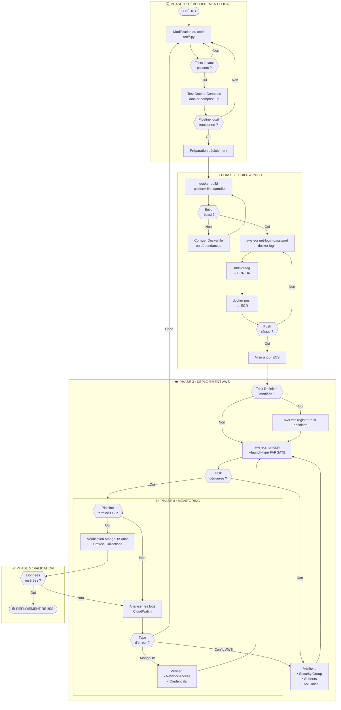
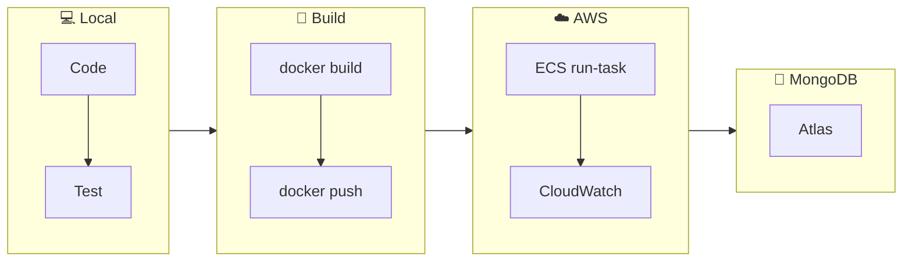
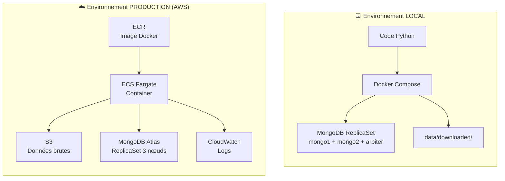

# 🚀 Logigramme de Déploiement

Ce document décrit le processus complet de déploiement du pipeline ETL Forecast 2.0, du développement local jusqu'à l'exécution sur AWS.

---

## 📋 Table des matières

1. [Vue d'ensemble](#-vue-densemble)
2. [Logigramme de déploiement](#-logigramme-de-déploiement)
3. [Détail des étapes](#-détail-des-étapes)
4. [Environnements](#-environnements)

---

## 🎯 Vue d'ensemble

Le déploiement suit un flux en 3 phases :

| Phase | Description | Outils |
|-------|-------------|--------|
| **1. Build** | Construction de l'image Docker | Docker, Dockerfile |
| **2. Push** | Publication sur le registry AWS | ECR, AWS CLI |
| **3. Run** | Exécution sur le cloud | ECS Fargate |

---

## 📊 Logigramme de déploiement



---

## 📝 Détail des étapes

### Phase 1 : Développement local

| Étape | Commande | Description |
|-------|----------|-------------|
| Tests unitaires | `pytest tests/` | Validation du code |
| Test Docker Compose | `docker-compose up` | Test avec MongoDB local |
| Vérification logs | `docker logs forecast-etl` | S'assurer que le pipeline fonctionne |

### Phase 2 : Build & Push

| Étape | Commande | Description |
|-------|----------|-------------|
| Build image | `docker build --platform linux/amd64 -t forecast-etl .` | Construction pour architecture AMD64 |
| Login ECR | `aws ecr get-login-password \| docker login` | Authentification au registry |
| Tag image | `docker tag forecast-etl:latest <ECR_URI>:latest` | Préparation pour push |
| Push image | `docker push <ECR_URI>:latest` | Upload vers ECR |

### Phase 3 : Déploiement AWS

| Étape | Commande | Description |
|-------|----------|-------------|
| Register Task | `aws ecs register-task-definition --cli-input-json file://task-definition.json` | Mise à jour de la définition |
| Run Task | `aws ecs run-task --cluster greenandcoop-cluster --task-definition forecast-etl ...` | Lancement du conteneur |

### Phase 4 : Monitoring

| Étape | Commande | Description |
|-------|----------|-------------|
| Logs temps réel | `aws logs tail /ecs/forecast-etl --follow` | Suivi de l'exécution |
| Statut task | `aws ecs describe-tasks --cluster ... --tasks <ARN>` | Vérification du statut |

### Phase 5 : Validation

| Étape | Action | Description |
|-------|--------|-------------|
| MongoDB Atlas | Browse Collections | Vérifier les documents insérés |
| Scripts reporting | `python -m src.reporting.check_quality` | Audit qualité |

---

## 🔄 Logigramme simplifié (Quick Reference)



---

## 🌍 Environnements

### Comparaison Local vs Production



### Variables d'environnement par environnement

| Variable | Local (Docker Compose) | Production (ECS) |
|----------|------------------------|------------------|
| `MONGO_URI` | ❌ Non défini | ✅ `mongodb+srv://...` |
| `MONGO_HOST` | `mongo1` | ❌ Non défini |
| `MONGO_REPLICA_SET` | `rs0` | ❌ Non défini |
| `S3_BUCKET_NAME` | `greenandcoop-forecast-raw-data` | `greenandcoop-forecast-raw-data` |
| `AWS_REGION` | `eu-west-3` | `eu-west-3` |

---

## 🔧 Commandes rapides

```bash
# BUILD & PUSH ===
docker build --platform linux/amd64 -t forecast-etl .
docker tag forecast-etl:latest 718281697661.dkr.ecr.eu-west-3.amazonaws.com/forecast-etl:latest
aws ecr get-login-password --region eu-west-3 | docker login --username AWS --password-stdin 718281697661.dkr.ecr.eu-west-3.amazonaws.com
docker push 718281697661.dkr.ecr.eu-west-3.amazonaws.com/forecast-etl:latest

# DEPLOY
aws ecs run-task \
    --cluster greenandcoop-cluster \
    --task-definition forecast-etl \
    --launch-type FARGATE \
    --network-configuration "awsvpcConfiguration={subnets=[subnet-0610fc62ccc083094],securityGroups=[sg-07977d25910df81a9],assignPublicIp=ENABLED}" \
    --region eu-west-3

# MONITOR
aws logs tail /ecs/forecast-etl --follow --region eu-west-3
```

---

## 📊 Légende des symboles

| Symbole | Forme Mermaid | Signification |
|---------|---------------|---------------|
| ⬭ | `([texte])` | Début / Fin |
| ▭ | `[texte]` | Processus / Action |
| ◇ | `{{texte}}` | Décision / Condition |
| ▱ | `[/texte/]` | Entrée / Sortie |
| ⬡ | `subgraph` | Regroupement / Phase |

---

## 🔗 Documents liés

- [README Principal](../README.md) - Architecture technique
- [Commandes AWS](../AWS_COMMANDS.md) - Référence CLI
- [Migration Logic](MIGRATION_LOGIC.md) - Processus de chargement

---

