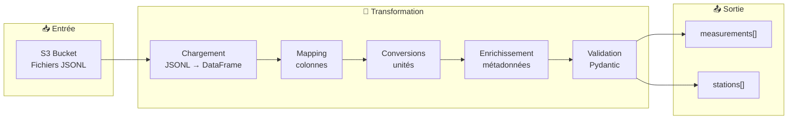

# 🔄 Logique de Transformation des Données

Ce document décrit en détail le processus de transformation des données brutes issues de S3 vers un format normalisé compatible avec MongoDB.

---

## 📋 Table des matières

1. [Vue d'ensemble](#-vue-densemble)
2. [Sources de données](#-sources-de-données)
3. [Processus de transformation](#-processus-de-transformation)
4. [Règles de conversion](#-règles-de-conversion)
5. [Validation des données](#-validation-des-données)
6. [Gestion des erreurs](#-gestion-des-erreurs)
7. [Scripts concernés](#-scripts-concernés)

---

## 🎯 Vue d'ensemble

### Objectifs

1. **Uniformiser** les données provenant de sources hétérogènes (Weather Underground, InfoClimat)
2. **Convertir** les unités de mesure vers le système métrique international
3. **Valider** les données selon un schéma strict (Pydantic)
4. **Enrichir** les mesures avec les métadonnées des stations

### Flux de transformation



---

## 📡 Sources de données

### Fichiers traités

| Fichier | Source | Type | Contenu |
|---------|--------|------|---------|
| `station_ichtegem_BE.jsonl` | Weather Underground | Mesures | Relevés météo Ichtegem (Belgique) |
| `station_la_madelaine_FR.jsonl` | Weather Underground | Mesures | Relevés météo La Madeleine (France) |
| `stations_info_climat.jsonl` | InfoClimat | Stations | Métadonnées stations Hauts-de-France |

### Format d'entrée (Airbyte JSONL)

Les fichiers générés par Airbyte ont la structure suivante :

```json
{"_airbyte_data": {"Time": "12:00 AM", "Temperature": "57.0 °F", "Humidity": "87 %", ...}}
{"_airbyte_data": {"Time": "12:10 AM", "Temperature": "56.8 °F", "Humidity": "88 %", ...}}
```

### Métadonnées des stations (hardcodées)

Les métadonnées des stations Weather Underground sont définies dans le script :

```python
STATION_METADATA = {
    "station_la_madelaine_FR.jsonl": {
        "station_id": "ILAMAD25",
        "station_name": "La Madeleine",
        "city": "La Madeleine",
        "latitude": 50.659,
        "longitude": 3.07,
        "elevation": 23
    },
    "station_ichtegem_BE.jsonl": {
        "station_id": "IICHTE19",
        "station_name": "WeerstationBS",
        "city": "Ichtegem",
        "latitude": 51.092,
        "longitude": 2.999,
        "elevation": 15
    }
}
```

---

## 🔄 Processus de transformation

### Étape 1 : Chargement des fichiers JSONL

```python
def load_airbyte_jsonl(file_path: str) -> pd.DataFrame:
    """
    Lit un fichier JSONL généré par Airbyte.
    Extrait le contenu de '_airbyte_data' pour chaque ligne.
    """
    data_list = []
    with open(file_path, 'r', encoding='utf-8') as f:
        for line in f:
            record = json.loads(line)
            if '_airbyte_data' in record:
                data_list.append(record['_airbyte_data'])
    return pd.DataFrame(data_list)
```

### Étape 2 : Mapping des colonnes

Les colonnes brutes sont renommées vers un schéma standardisé :

| Colonne source | Colonne cible | Description |
|----------------|---------------|-------------|
| `Time` | `time_str` | Heure du relevé (string) |
| `Temperature` | `temp_raw` | Température brute (°F) |
| `Humidity` | `humidity_percent` | Humidité relative (%) |
| `Dew Point` | `dew_point` | Point de rosée |
| `Wind` | `wind_direction` | Direction du vent |
| `Speed` | `wind_speed_raw` | Vitesse du vent (mph) |
| `Gust` | `wind_gust_raw` | Rafales (mph) |
| `Pressure` | `pressure_inHg` | Pression (inHg) |
| `Precip. Rate.` | `precip_rate` | Taux de précipitation |
| `Precip. Accum.` | `precip_accum` | Cumul de précipitation |

### Étape 3 : Conversions d'unités

```python
def fahrenheit_to_celsius(f):
    """Convertit Fahrenheit vers Celsius."""
    if f is None: return None
    return round((f - 32) * 5.0/9.0, 2)

def mph_to_kmh(mph):
    """Convertit miles/heure vers km/heure."""
    if mph is None: return None
    return round(mph * 1.60934, 2)

def inHg_to_hPa(inHg):
    """Convertit pouces de mercure vers hectopascals."""
    if inHg is None: return None
    return round(inHg * 33.8639, 1)
```

### Étape 4 : Enrichissement des métadonnées

Chaque mesure est enrichie avec les informations de la station :

```python
for key, value in STATION_METADATA[filename].items():
    df[key] = value
```

Résultat : Chaque ligne contient `station_id`, `station_name`, `latitude`, `longitude`, `elevation`.

### Étape 5 : Construction du timestamp

```python
# Combinaison date du jour + heure du relevé
today_str = pd.Timestamp.now().strftime('%Y-%m-%d')
df['timestamp'] = pd.to_datetime(today_str + ' ' + df['time_str'].astype(str))

# Ajout d'un offset pour différencier les relevés de même heure
df['timestamp'] = df['timestamp'] + pd.to_timedelta(df.index, unit='s')
```

---

## 📏 Règles de conversion

### Tableau récapitulatif

| Mesure | Unité source | Unité cible | Formule |
|--------|--------------|-------------|---------|
| Température | °F | °C | `(F - 32) × 5/9` |
| Vitesse du vent | mph | km/h | `mph × 1.60934` |
| Pression | inHg | hPa | `inHg × 33.8639` |
| Humidité | % | % | Aucune (nettoyage) |

### Nettoyage des valeurs

```python
def clean_value(val):
    """
    Nettoie une valeur brute :
    - Gère les NaN et valeurs vides
    - Extrait les nombres des chaînes (ex: "57.0 °F" → 57.0)
    """
    if pd.isna(val) or val == "":
        return None
    if isinstance(val, (int, float)):
        return float(val)
    # Extraction du nombre via regex
    match = re.search(r"[-+]?\d*\.\d+|\d+", str(val))
    if match:
        return float(match.group())
    return None
```

---

## ✅ Validation des données

### Schéma Pydantic

Les données sont validées via un modèle Pydantic strict :

```python
from pydantic import BaseModel, Field, field_validator

class WeatherMeasurement(BaseModel):
    station_id: str                                      # Requis
    station_name: Optional[str] = None
    timestamp: datetime                                  # Requis
    
    # Règles de validation strictes
    temperature_celsius: float = Field(ge=-60, le=60)    # -60°C à +60°C
    humidity_percent: Optional[float] = Field(None, ge=0, le=100)
    wind_speed_kmh: Optional[float] = Field(None, ge=0)  # Pas de vent négatif
    pressure_hpa: Optional[float] = Field(None, ge=800, le=1200)
    latitude: Optional[float] = None
    longitude: Optional[float] = None
```

### Règles de validation

| Champ | Règle | Motif de rejet |
|-------|-------|----------------|
| `station_id` | Requis, non vide | `station_id: Field required` |
| `timestamp` | Requis, type datetime | `timestamp: Invalid datetime` |
| `temperature_celsius` | -60 ≤ T ≤ +60 | `temperature_celsius: greater than or equal to -60` |
| `humidity_percent` | 0 ≤ H ≤ 100 | `humidity_percent: less than or equal to 100` |
| `wind_speed_kmh` | ≥ 0 | `wind_speed_kmh: greater than or equal to 0` |
| `pressure_hpa` | 800 ≤ P ≤ 1200 | `pressure_hpa: Input should be >= 800` |

### Gestion des NaN

```python
@field_validator('temperature_celsius', 'humidity_percent', 'wind_speed_kmh', mode='before')
@classmethod
def handle_nan(cls, v):
    """Convertit les NaN pandas en None Python."""
    if pd.isna(v) or v == "":
        return None
    return v
```

---

## ⚠️ Gestion des erreurs

### Documents rejetés

Les documents qui échouent à la validation sont :
1. **Loggés** avec le motif de rejet
2. **Exclus** du chargement MongoDB
3. **Comptabilisés** pour le taux d'erreur

```python
def validate_data(records: list) -> tuple:
    """
    Valide une liste d'enregistrements via Pydantic.
    Retourne (valid_records, rejected_records).
    """
    valid_records = []
    rejected_records = []

    for record in records:
        try:
            measurement = WeatherMeasurement(**record)
            valid_records.append(measurement.model_dump())
        except ValidationError as e:
            error_messages = [f"{err['loc'][0]}: {err['msg']}" for err in e.errors()]
            record['rejection_reason'] = "; ".join(error_messages)
            rejected_records.append(record)

    return valid_records, rejected_records
```

### Exemple de log

```
2025-12-24 15:18:21 - WARNING - Validation Météo : 3 lignes rejetées dans station_ichtegem_BE.jsonl.
2025-12-24 15:18:21 - WARNING - Exemple motif : temperature_celsius: Input should be less than or equal to 60
```

### Taux d'erreur actuel

| Métrique | Valeur |
|----------|--------|
| Documents traités | 3811 |
| Documents valides | 3811 |
| Documents rejetés | 0 |
| **Taux d'erreur** | **0%** |

---

## 📁 Scripts concernés

### Fichiers

| Script | Rôle |
|--------|------|
| `src/processing/cleaner.py` | Transformation et nettoyage |
| `src/processing/validator.py` | Validation Pydantic |
| `src/connectors/s3_connector.py` | Téléchargement depuis S3 |

### Fonctions principales

```python
# cleaner.py
process_file(file_path, filename)      # Routeur principal
transform_weather_data(file_path, filename)  # Transformation mesures météo
transform_infoclimat(file_path)        # Transformation stations InfoClimat
load_airbyte_jsonl(file_path)          # Lecture JSONL
clean_value(val)                       # Nettoyage valeurs
fahrenheit_to_celsius(f)               # Conversion °F → °C
mph_to_kmh(mph)                        # Conversion mph → km/h

# validator.py
validate_data(records)                 # Validation Pydantic
WeatherMeasurement                     # Modèle de validation
```

---

## 🔗 Documents liés

- [Logique de Migration](MIGRATION_LOGIC.md) - Chargement dans MongoDB
- [README Principal](../README.md) - Vue d'ensemble du projet

---

