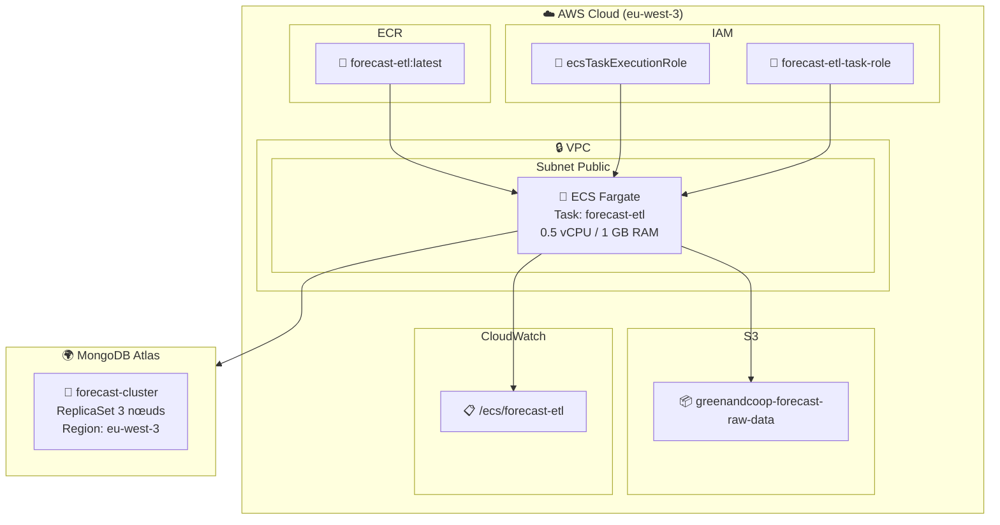

### Architecture de déploiement AWS

```mermaid
flowchart TB
    subgraph AWS["☁️ AWS Cloud (eu-west-3)"]
        subgraph VPC["🔒 VPC"]
            subgraph SUBNET["Subnet Public"]
                ECS["🐳 ECS Fargate<br/>Task: forecast-etl<br/>0.5 vCPU / 1 GB RAM"]
            end
        end

        subgraph S3_SERVICE["S3"]
            S3["📦 greenandcoop-forecast-raw-data"]
        end

        subgraph ECR_SERVICE["ECR"]
            ECR["🐋 forecast-etl:latest"]
        end

        subgraph CW_SERVICE["CloudWatch"]
            CW["📋 /ecs/forecast-etl"]
        end

        subgraph IAM_SERVICE["IAM"]
            ROLE1["🔑 ecsTaskExecutionRole"]
            ROLE2["🔑 forecast-etl-task-role"]
        end
    end

    subgraph ATLAS["🌍 MongoDB Atlas"]
        CLUSTER["🍃 forecast-cluster<br/>ReplicaSet 3 nœuds<br/>Region: eu-west-3"]
    end

    ECR --> ECS
    ECS --> S3
    ECS --> ATLAS
    ECS --> CW
    ROLE1 --> ECS
    ROLE2 --> ECS
```