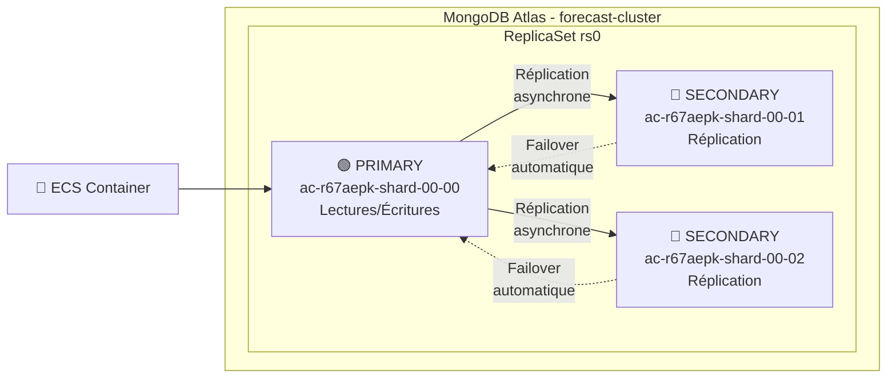

### Architecture MongoDB Atlas (ReplicaSet)

```mermaid
flowchart LR
    subgraph ATLAS["MongoDB Atlas - forecast-cluster"]
        subgraph RS["ReplicaSet rs0"]
            P["🟢 PRIMARY<br/>ac-r67aepk-shard-00-00<br/>Lectures/Écritures"]
            S1["🔵 SECONDARY<br/>ac-r67aepk-shard-00-01<br/>Réplication"]
            S2["🔵 SECONDARY<br/>ac-r67aepk-shard-00-02<br/>Réplication"]
        end
    end

    APP["🐳 ECS Container"] --> P
    P -->|"Réplication<br/>asynchrone"| S1
    P -->|"Réplication<br/>asynchrone"| S2

    S1 -.->|"Failover<br/>automatique"| P
    S2 -.->|"Failover<br/>automatique"| P
```