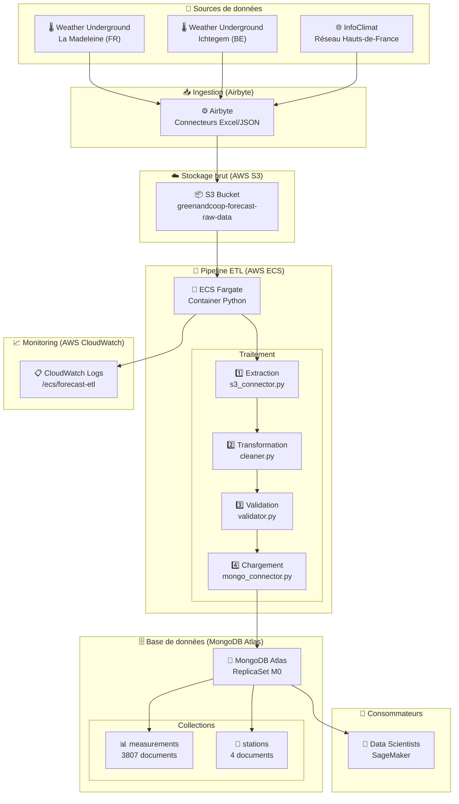

### Architecture globale

```mermaid
flowchart TB
    subgraph SOURCES["📡 Sources de données"]
        WU1["🌡️ Weather Underground<br/>La Madeleine (FR)"]
        WU2["🌡️ Weather Underground<br/>Ichtegem (BE)"]
        IC["🌐 InfoClimat<br/>Réseau Hauts-de-France"]
    end

    subgraph INGESTION["📥 Ingestion (Airbyte)"]
        AB["⚙️ Airbyte<br/>Connecteurs Excel/JSON"]
    end

    subgraph STOCKAGE_RAW["☁️ Stockage brut (AWS S3)"]
        S3["📦 S3 Bucket<br/>greenandcoop-forecast-raw-data"]
    end

    subgraph ETL["🔄 Pipeline ETL (AWS ECS)"]
        ECS["🐳 ECS Fargate<br/>Container Python"]

        subgraph PROCESSING["Traitement"]
            EX["1️⃣ Extraction<br/>s3_connector.py"]
            TR["2️⃣ Transformation<br/>cleaner.py"]
            VA["3️⃣ Validation<br/>validator.py"]
            LO["4️⃣ Chargement<br/>mongo_connector.py"]
        end
    end

    subgraph STOCKAGE_FINAL["🗄️ Base de données (MongoDB Atlas)"]
        ATLAS["🍃 MongoDB Atlas<br/>ReplicaSet M0"]

        subgraph COLLECTIONS["Collections"]
            MEAS["📊 measurements<br/>3807 documents"]
            STAT["📍 stations<br/>4 documents"]
        end
    end

    subgraph MONITORING["📈 Monitoring (AWS CloudWatch)"]
        CW["📋 CloudWatch Logs<br/>/ecs/forecast-etl"]
    end

    subgraph CONSUMERS["👥 Consommateurs"]
        DS["🧪 Data Scientists<br/>SageMaker"]
    end

    WU1 --> AB
    WU2 --> AB
    IC --> AB
    AB --> S3
    S3 --> ECS
    ECS --> EX --> TR --> VA --> LO
    LO --> ATLAS
    ATLAS --> MEAS
    ATLAS --> STAT
    ECS --> CW
    ATLAS --> DS
```