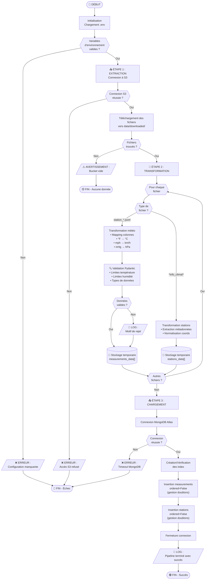

## 📊 Logigramme du processus ETL

### Processus global

### Légende des symboles

| Symbole               | Signification                   |
| --------------------- | ------------------------------- |
| ⬭ (Rectangle arrondi) | Début / Fin                     |
| ▭ (Rectangle)         | Processus / Action              |
| ◇ (Losange)           | Décision / Condition            |
| ▱ (Parallélogramme)   | Entrée / Sortie (logs, erreurs) |
| ⌓ (Cylindre)          | Stockage de données             |

