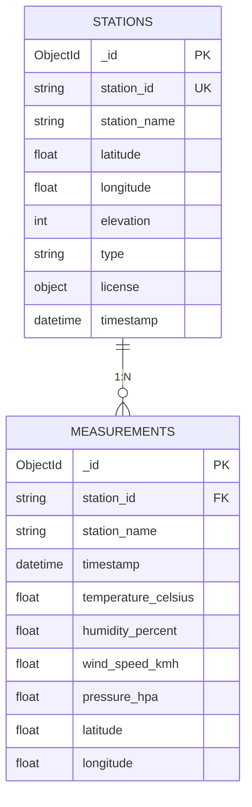

## 🗄️ Schéma de la base de données

### Vue d'ensemble

```mermaid
erDiagram
    MEASUREMENTS {
        ObjectId _id PK
        string station_id FK
        string station_name
        datetime timestamp
        float temperature_celsius
        float humidity_percent
        float wind_speed_kmh
        float pressure_hpa
        float latitude
        float longitude
    }

    STATIONS {
        ObjectId _id PK
        string station_id UK
        string station_name
        float latitude
        float longitude
        int elevation
        string type
        object license
        datetime timestamp
    }

    STATIONS ||--o{ MEASUREMENTS : "1:N"
```
